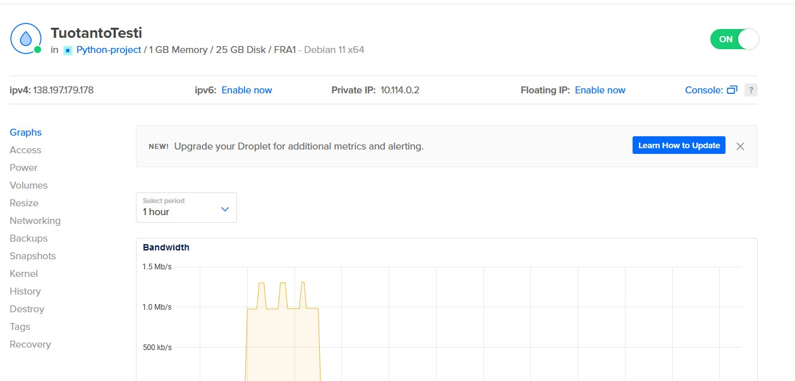
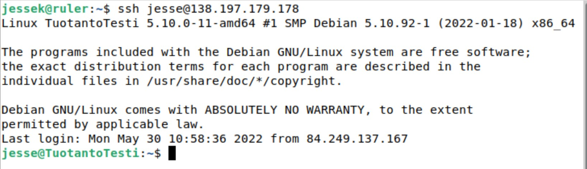
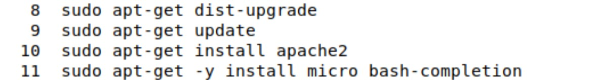
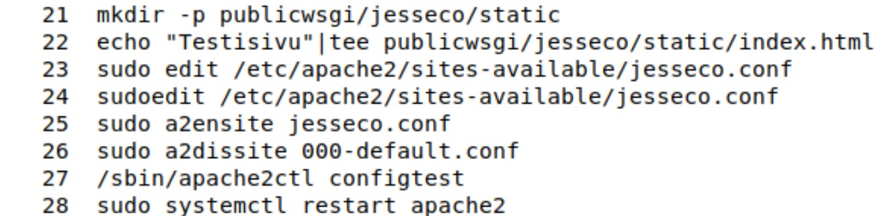
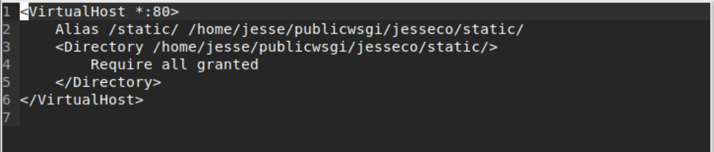
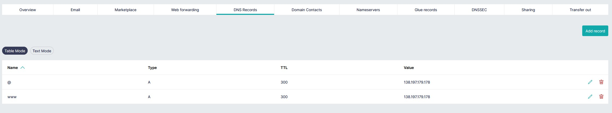
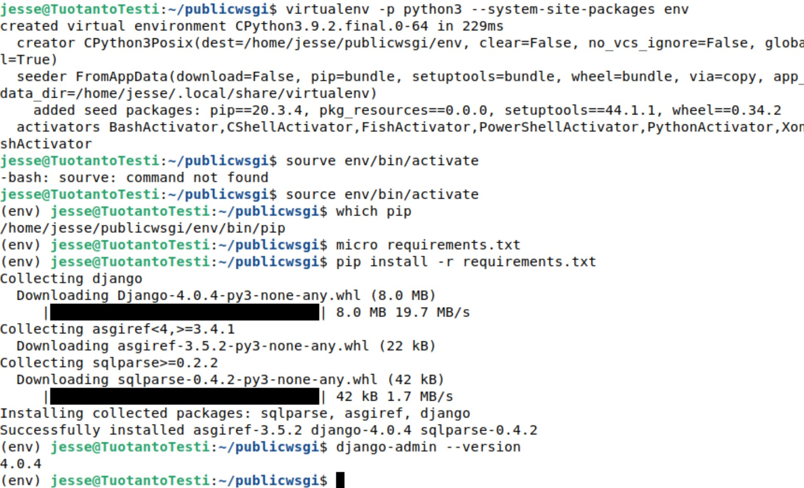
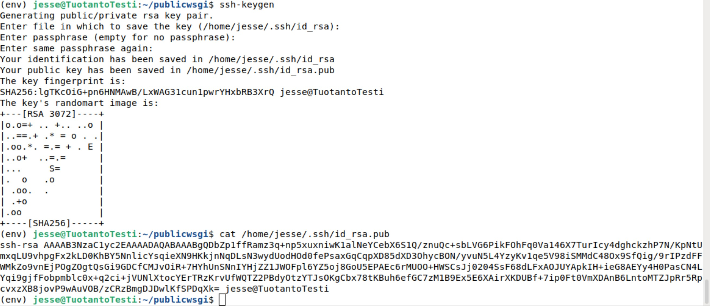
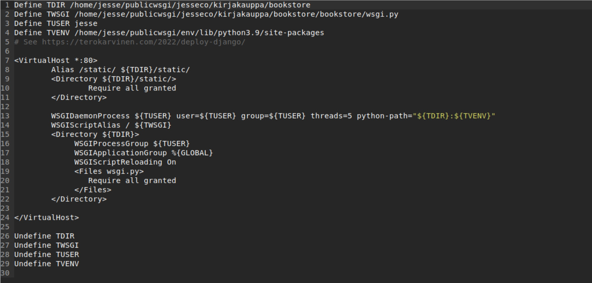
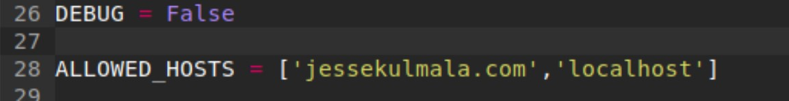

# pw5 kone pilvestä

## a) Vuokraa kone pilvestä. Sellainen kokonainen Linux-kone, virtual private server. Ota siihen ssh-yhteys.

Vuokrasimme oppitunnilla jos palvelimen, mutta lyhykäisyydessään, vuokrataan halvin mahdollinen palvelin läheltä asiakkaita ja hyväksi todetulla distrolla. Tässä tapauksessa frankfurtista ja debian 11. Ei mitään ylimääräistä tauhkaa palvelimentarjoajalta. 
## b) Laita vuokrakoneellesi weppipalvelin ja korvaa testisivu. Kokeile esim. kännykällä, että kone näkyy Internetiin.
Aloitetaan ottamalla ssh yhteys palvelimeen.

Ajetaan hieman asennuksia uudelle palvelimelle.

(Tässä välissä aloin säätämään kohtaa C)

Tehdään seuraavaksi weppisivulle hieman staattista sisältöä ja laitetaan se apachella pyörimään palvelimelle.

## c) Vuokraa tai lainaa domain nimi. Laita se osoittamaan omaan koneeseesi.

Mennään gandin DNS Records välilehdelle ja laitetaan nimi osoittamaan uudelle palvelimelle. Käydään kopioimassa iippari digitaloceanin käyttäjä paneelista.

## d) Tee Djangon tuotantoasennus niin pitkälle kuin osaat. Tämä tehtävä lienee haastavampi niille, jotka eivät ennestään osaa Linuxia ja palvelimia. Jos on haastavaa, tee siihen asti, että pääset johonkin konkreettiseen ongelmaan ja voimme katsoa huomenna lisää.

Aliitetaan asnetelemmalla virtualenv ja django.

Tehdään myös ssh-avainpari palvelimelle ja yhdistetään set githubiin niin voidaan hakea sieltä projekteja.

Seuraavaksi viritellään virtualhostin configiä, että se löytää juuri haetun django projektin. Tässä jouduin itse kamppailemaan hyvän tovin koska olin osannut luoda ihan mahdottomia kansiorakenteita itselleni. Lopputulos kuitenkin näyttää seuraavalta.

Laitetaan myös weppisivu sallittuihin hosteihin ja debug pois.

Tämä on vielä hieman vaiheessa. Jatketaan myöhemmin.

## e) Palauta Laksuun. Kirjoita palaute kahdesta kaverisi kotitehtävästä.

## f) Vapaaehtoinen: automatisoi päivitysten siirtäminen kehityspalvelimelta tuotantoon. Eli yhdellä komennolla tuotantopalvelimen koodien päivitys, tietokantamigraatiot ja uusi versio käyttöön.